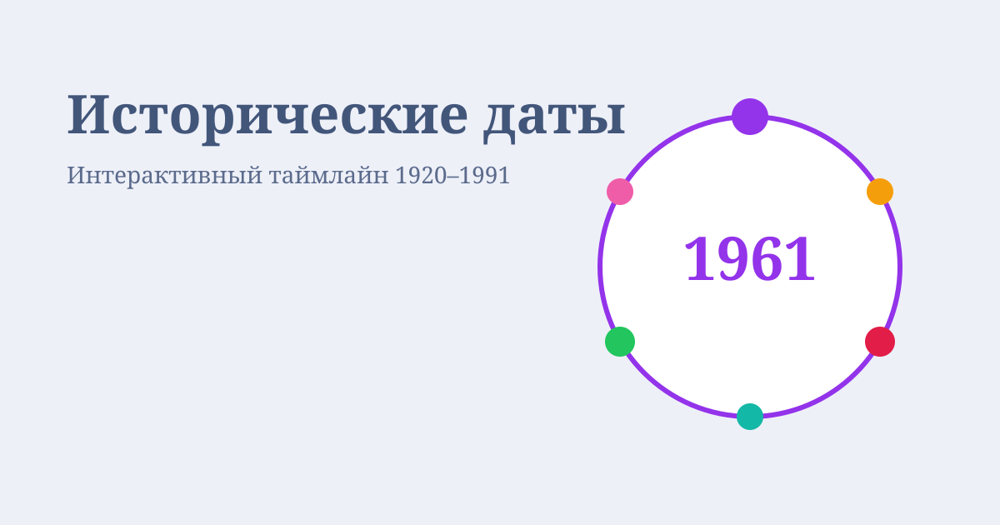

# Исторические даты

Интерактивный круговой таймлайн ключевых событий России и СССР **1920–1991** годов. Категории: наука, литература, физика, химия, технологии и культура.



## Стек

- React 19 + TypeScript
- Webpack 5 (`webpack-dev-server` для разработки)
- SCSS
- ESLint, Stylelint, Prettier

## Скрипты

```bash
npm install        # зависимости
npm run dev        # разработка, http://localhost:3000
npm run build      # production-сборка в dist/
npm run lint       # ESLint + Stylelint
npm run lint:fix   # автоисправления линтеров
npm run format     # Prettier
```

## Структура

```
src/
  App.tsx                 # header со справкой + main
  index.tsx               # точка входа
  components/             # UI: круг, панель, слайдер фактов
  styles/                 # SCSS и шрифты IBM Plex Mono
  public/                 # HTML, favicon, og-image, apple-touch-icon
  utils/consts.ts         # категории и факты
```

## Управление

- Категории: стрелки в панели, ↑ / ↓, колесо мыши на круге, перетаскивание, клик по точке
- Факты: стрелки под карточкой, ← / →
- Кнопка воспроизведения включает и останавливает автопрокрутку

## Установка

```bash
git clone https://github.com/olgaAsmith/circle.git
cd circle
npm install
npm run dev
```
